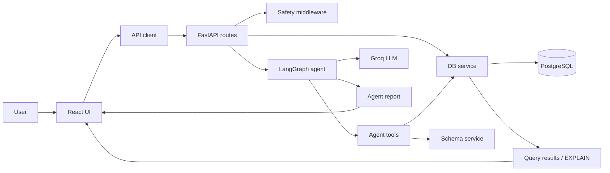
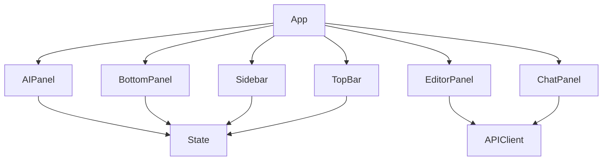
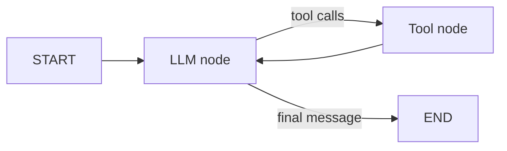
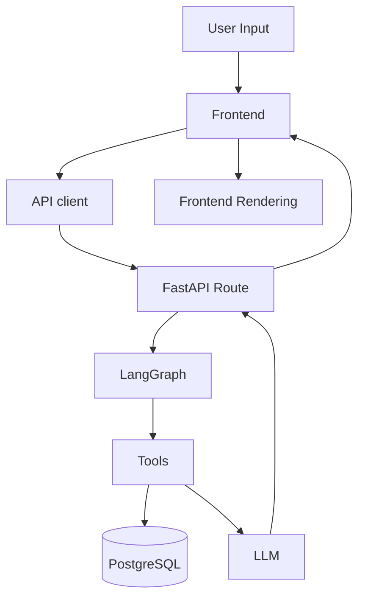
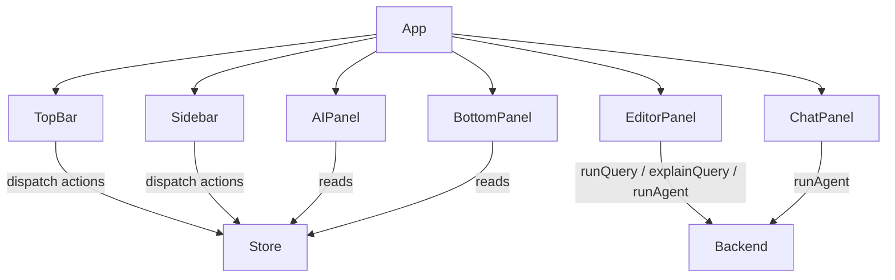

# PROJECT REPORT

## 1. Project Overview

This project is a full-stack SQL assistant for querying, debugging, explaining, and optimizing PostgreSQL queries with an agentic AI layer. The user interface is a React + Vite application with a Monaco editor, query results pane, execution plan viewer, AI report panel, chat panel, and local query history. The backend is FastAPI with async PostgreSQL access through `asyncpg`, and the AI layer is built on LangGraph with a Groq-hosted LLM.

Recent updates added a dedicated conversational chat route, a direct query analysis route, cleaner SQL execution handling, and a fixed history restore flow. The frontend now uses those routes directly and no longer carries the old streaming helper path.

The overall architecture is split into three main flows:

1. Direct query execution and EXPLAIN analysis for manual SQL.
2. Agentic analysis for query debugging, optimization, explainability, and NL-to-SQL conversion.
3. Local UI state and history restoration on the frontend.

The codebase is intentionally modular: backend concerns are divided into routes, services, middleware, and agent logic; frontend concerns are separated into reusable panels plus a small global store. The main design goal is an interactive SQL workbench that can both execute SQL and reason about it.

### Core Technologies

| Layer    | Stack                                                                                   |
| -------- | --------------------------------------------------------------------------------------- |
| Frontend | React 19, Vite, Tailwind CSS, Monaco Editor, `react-markdown`, `react-resizable-panels` |
| Backend  | FastAPI, `asyncpg`, `sqlalchemy` asyncio support, `pydantic`, `pydantic-settings`       |
| AI       | LangGraph, LangChain, `langchain-groq`                                                  |
| Database | PostgreSQL                                                                              |
| Tooling  | ESLint, Vite config, Tailwind/PostCSS config                                            |

### Overall Design

The app is primarily request/response driven today. The frontend no longer contains the old streaming helper, and the backend still does not expose a streaming endpoint.

## 2. Current Completion Status

### Completion Estimate

| Area           | Estimate | Why                                                                                                                                                                                                                                |
| -------------- | -------: | ---------------------------------------------------------------------------------------------------------------------------------------------------------------------------------------------------------------------------------- |
| Frontend       |      93% | The UI shell, editor, results, execution plan, history, AI panels, and chat flow are implemented and build successfully. Persistent chat memory is still missing, but the previous restore bug is fixed.                           |
| Backend        |      82% | Core endpoints, DB pooling, safety checks, LangGraph integration, query analysis, and a dedicated chat route now exist. The schema service still has a critical stale-pool bug, and streaming remains absent.                      |
| Database       |      90% | A complete sample schema and data seed exist, plus schema/index introspection logic. There is no migration layer or real production schema management.                                                                             |
| AI Agent       |      82% | LangGraph loop, tools, and prompt are implemented. The agent is still constrained by the schema-service bug, but the app now also has a conversational chat route and query-level analysis path.                                   |
| Streaming      |      10% | The old frontend streaming client path is gone, and there is still no backend streaming route. Streaming remains unimplemented rather than partially functional.                                                                   |
| Execution Plan |      65% | EXPLAIN ANALYZE is implemented and visualized, and Query mode now automatically pairs execution with analysis. Dedicated optimization workflow beyond prompt logic is still limited.                                               |
| Testing        |      20% | I confirmed a frontend production build and backend startup path, but there are no visible automated tests in the repo.                                                                                                            |
| Overall        |      79% | The app is structurally solid and noticeably closer to a usable MVP, with chat, query analysis, and history improvements reducing friction. The main remaining gaps are broken schema introspection and missing streaming support. |

## 3. Folder Structure

| Folder                     | Purpose                                                                                                  |
| -------------------------- | -------------------------------------------------------------------------------------------------------- |
| `backend/`                 | FastAPI application, PostgreSQL access, safety middleware, LangGraph agent, and SQL execution endpoints. |
| `backend/routes/`          | HTTP endpoints for manual SQL, EXPLAIN, schema inspection, and agent runs.                               |
| `backend/services/`        | Database pool management and schema/index introspection utilities.                                       |
| `backend/agent/`           | LangGraph state, tools, nodes, and graph wiring.                                                         |
| `backend/middleware/`      | Request-layer SQL safety checks.                                                                         |
| `frontend/`                | Vite React app, UI, state store, API client, styling, and static assets.                                 |
| `frontend/src/components/` | UI panels: top bar, sidebar, editor, AI report, chat, and result/output panes.                           |
| `frontend/src/store/`      | Global reducer-based state for editor, query results, agent output, and history.                         |
| `frontend/src/api/`        | Axios/fetch API wrapper for backend interaction.                                                         |
| `frontend/src/assets/`     | Static assets and illustration used by the UI.                                                           |
| `frontend/public/`         | Public SVG assets served by Vite.                                                                        |
| `.vscode/`                 | Workspace editor settings.                                                                               |

## 4. File-by-File Analysis

### Backend and Root Files

| File                       | Purpose / Responsibilities                                           | Main Functions                                   | Dependencies                                           | Called By / Calls                                               | Status                                                                                                      | Potential Problems                                                                                 | Future Improvements                                                                          |
| -------------------------- | -------------------------------------------------------------------- | ------------------------------------------------ | ------------------------------------------------------ | --------------------------------------------------------------- | ----------------------------------------------------------------------------------------------------------- | -------------------------------------------------------------------------------------------------- | -------------------------------------------------------------------------------------------- |
| `README.md`                | Project overview, setup, architecture summary, and endpoint listing. | Documentation only.                              | None at runtime.                                       | Read by developers; mirrors implementation at a high level.     | Mostly accurate but now incomplete because streaming is not implemented and schema access has a hidden bug. | Claims or implies complete agent tool flow without calling out the schema pool issue.              | Keep synchronized with real behavior; add note about missing streaming route.                |
| `backend/main.py`          | FastAPI entrypoint, lifecycle, CORS, routers, health endpoint.       | `lifespan()`, `health()`.                        | `config`, `services.db`, `middleware.safety`, routers. | Called by Uvicorn; calls DB init/test/close and router modules. | Working.                                                                                                    | CORS is tied to one origin; if frontend origin changes, requests can fail.                         | Externalize more deployment settings; add startup health logging around schema availability. |
| `backend/config.py`        | Environment-backed application settings.                             | `Settings`, `get_settings()`, `db_url` property. | `pydantic-settings`, env vars.                         | Imported by almost every backend module.                        | Working.                                                                                                    | No `.env.example` exists, so onboarding is manual.                                                 | Add documented env template outside this audit scope.                                        |
| `backend/requirements.txt` | Backend dependency lock list.                                        | N/A.                                             | Python packages.                                       | Used during backend install.                                    | Working.                                                                                                    | Versions are pinned but there is no lock audit or compatibility matrix.                            | Consider periodic dependency review.                                                         |
| `backend/setup_db.sql`     | Seed schema and demo data for PostgreSQL.                            | N/A.                                             | PostgreSQL DDL/DML.                                    | Run manually by developers.                                     | Working for sample data setup.                                                                              | No migrations, no indexes beyond primary keys and unique email; real data volumes may need tuning. | Add migration workflow and production schema management.                                     |

### Backend Routes / Services / Agent

| File                           | Purpose / Responsibilities                                          | Main Functions                                                                                                                        | Dependencies                                       | Called By / Calls                                                                   | Status                                      | Potential Problems                                                                                                                                                                                     | Future Improvements                                                                          |
| ------------------------------ | ------------------------------------------------------------------- | ------------------------------------------------------------------------------------------------------------------------------------- | -------------------------------------------------- | ----------------------------------------------------------------------------------- | ------------------------------------------- | ------------------------------------------------------------------------------------------------------------------------------------------------------------------------------------------------------ | -------------------------------------------------------------------------------------------- |
| `backend/routes/query.py`      | Manual SQL execution, EXPLAIN, schema endpoint, and query analysis. | `run_query()`, `explain_query()`, `get_schema()`, `analyze_query()`.                                                                  | `services.db`, `services.schema`, `ChatGroq`.      | Called by `frontend/src/api/client.js`; calls DB, schema, and Groq services.        | Working, with a schema fallback limitation. | Schema endpoint still depends on the stale pool import in `services/schema.py`; the new analysis route falls back to text-only analysis if schema lookup fails.                                        | Add schema fix, caching, and a clearer structured response for analysis.                     |
| `backend/routes/chat.py`       | Conversational LLM endpoint without tool use.                       | `send_message()`.                                                                                                                     | `ChatGroq`, conversation history, `config`.        | Called by `frontend/src/components/ChatPanel.jsx` via `frontend/src/api/client.js`. | Working.                                    | History is client-supplied and session-local; there is no persistent server memory yet.                                                                                                                | Add persistent chat memory or shared conversation storage if needed.                         |
| `backend/routes/agent.py`      | Agent HTTP interface for LangGraph analysis runs.                   | `_build_user_message()`, `_clean_error()`, `_extract_steps()`, `run_agent()`.                                                         | `agent.graph`, `agent.state`, LangChain messages.  | Called by frontend AI/chat flows; calls LangGraph agent.                            | Working but constrained.                    | No streaming endpoint; step extraction only reflects tool call metadata.                                                                                                                               | Add streaming SSE endpoint and richer step telemetry.                                        |
| `backend/services/db.py`       | Connection pool, query execution, EXPLAIN, safety enforcement.      | `init_db()`, `close_db()`, `execute_sql()`, `execute_explain()`, `test_connection()`, `_check_safety()`, `_strip_semicolon()`.        | `asyncpg`, `config`.                               | Called by routes and agent tools.                                                   | Working, with design limitations.           | Fetches the full result set before truncating, which can be expensive; safety is keyword-based and not a full parser. The new semicolon stripping and EXPLAIN normalization reduce avoidable failures. | Stream rows or paginate; use stronger read-only enforcement if needed.                       |
| `backend/services/schema.py`   | Schema and index introspection against PostgreSQL metadata.         | `get_full_schema()`, `get_table_indexes()`.                                                                                           | `services.db.pool`.                                | Called by query route and agent tools.                                              | Broken due to stale import bug.             | Imports `pool` by value from `services.db`, so it stays `None` after `init_db()` reassigns the module variable. This likely breaks schema and index introspection everywhere.                          | Import the module or access `services.db.pool` dynamically; add tests for pool availability. |
| `backend/middleware/safety.py` | HTTP-layer SQL safety filter.                                       | `QuerySafetyMiddleware.dispatch()`, `_check()`.                                                                                       | FastAPI/Starlette middleware.                      | Runs before protected query routes.                                                 | Working but heuristic.                      | Keyword scanning can miss clever bypasses and duplicates safety logic from `services.db`.                                                                                                              | Replace with a parser-based safety policy or a single source of truth.                       |
| `backend/agent/state.py`       | LangGraph state schema and reducers.                                | `AgentState` TypedDict.                                                                                                               | LangGraph message reducer.                         | Used by `agent.graph` and agent nodes.                                              | Working.                                    | State is broad and mostly unvalidated; some fields are currently unused.                                                                                                                               | Tighten field use or split state into smaller typed objects.                                 |
| `backend/agent/tools.py`       | All agent tools exposed to the LLM.                                 | `run_query()`, `run_explain_analyze()`, `get_schema()`, `get_indexes()`, `check_query_safety()`, `_summarize_plan()`, `_walk_plan()`. | `services.db`, `services.schema`, `config`.        | Called by LangGraph tool execution.                                                 | Partially working.                          | Tools relying on schema/index lookup inherit the broken schema pool issue.                                                                                                                             | Add tool-level tests and richer structured outputs.                                          |
| `backend/agent/nodes.py`       | LLM node and continuation logic.                                    | `agent_node()`, `should_continue()`, `tool_node`.                                                                                     | `ChatGroq`, LangGraph `ToolNode`, settings, tools. | Called by LangGraph graph runtime.                                                  | Working.                                    | Uses a fixed model name and Groq key; no fallback model provider.                                                                                                                                      | Add provider abstraction and better loop telemetry.                                          |
| `backend/agent/graph.py`       | LangGraph wiring and compilation.                                   | `build_agent_graph()`, `agent_graph`.                                                                                                 | LangGraph `StateGraph`, agent nodes.               | Imported by agent route.                                                            | Working.                                    | Graph is simple and single-path; limited explicit branching.                                                                                                                                           | Add richer routing for error recovery or mode-specific flows.                                |

### Frontend App / State / API

| File                                | Purpose / Responsibilities                        | Main Functions                                                                                      | Dependencies                                                  | Called By / Calls                | Status   | Potential Problems                                                                                                                                  | Future Improvements                                                       |
| ----------------------------------- | ------------------------------------------------- | --------------------------------------------------------------------------------------------------- | ------------------------------------------------------------- | -------------------------------- | -------- | --------------------------------------------------------------------------------------------------------------------------------------------------- | ------------------------------------------------------------------------- |
| `frontend/src/main.jsx`             | React bootstrap.                                  | `createRoot(...).render(...)`.                                                                      | React DOM, `App`, global CSS.                                 | Browser entry point.             | Working. | None major.                                                                                                                                         | None necessary.                                                           |
| `frontend/src/App.jsx`              | Global layout and responsive panel orchestration. | `App()`.                                                                                            | `useAppState`, panels, `react-resizable-panels`, `useEffect`. | Renders all major UI components. | Working. | Mobile/tablet state logic is locally managed and somewhat duplicated.                                                                               | Centralize layout breakpoints if future complexity grows.                 |
| `frontend/src/store/useAppState.js` | App-wide reducer state and history persistence.   | `reducer()`, `useAppState()`, `addHistory()`, `CLEAR_ALL_HISTORY`.                                  | React `useReducer`, `localStorage`.                           | Consumed by app and panels.      | Working. | History is still localStorage-only, but `LOAD_HISTORY_ITEM` is now restore-only and `CLEAR_ALL_HISTORY` gives users an explicit destructive action. | Add persistence beyond localStorage if cross-device continuity is needed. |
| `frontend/src/api/client.js`        | API client for backend routes.                    | `runQuery()`, `explainQuery()`, `getSchema()`, `analyzeQuery()`, `runAgent()`, `sendChatMessage()`. | Axios, `fetch`, env `VITE_API_URL`.                           | Called by editor/chat panels.    | Working. | The old streaming client path is gone, so assistant output is currently synchronous.                                                                | Add a streaming client only after the backend route exists.               |

### Frontend Components

| File                                      | Purpose / Responsibilities                                              | Main Functions                                                                                     | Dependencies                                      | Called By / Calls                                    | Status                | Potential Problems                                                                                                                               | Future Improvements                                                                       |
| ----------------------------------------- | ----------------------------------------------------------------------- | -------------------------------------------------------------------------------------------------- | ------------------------------------------------- | ---------------------------------------------------- | --------------------- | ------------------------------------------------------------------------------------------------------------------------------------------------ | ----------------------------------------------------------------------------------------- |
| `frontend/src/components/TopBar.jsx`      | Mode selection, SQL/NL toggle, sidebar and AI panel controls.           | `TopBar()`, `handleModeClick()`.                                                                   | `lucide-react`, `clsx`, store actions.            | Used by `App`; dispatches global actions.            | Working.              | NL mode uses `sql`/`nl` state split that depends on the editor panel behavior.                                                                   | Add clearer mode affordances when more modes are introduced.                              |
| `frontend/src/components/Sidebar.jsx`     | Query history viewer and loader.                                        | `formatTime()`, `formatDate()`, `Sidebar()`, `handleLoad()`, `handleDelete()`, `handleClearAll()`. | Store actions, `clsx`, icons.                     | Used by `App`; reads and updates history state.      | Working.              | History loading now restores without clearing; the remaining limitation is localStorage-only persistence.                                        | Persist history beyond the browser if cross-device continuity is required.                |
| `frontend/src/components/EditorPanel.jsx` | SQL editor, NL prompt input, run/clear actions, auto-run agent results. | `extractSqlFromReport()`, `handleRun()`, `handleClear()`.                                          | Monaco editor, API client, store actions.         | Used by `App`; calls query/agent/analyze endpoints.  | Working with caveats. | Query mode now performs an extra analysis call after successful SQL execution, so AI-panel updates can fail independently from the query itself. | Add more explicit result states and stronger report parsing.                              |
| `frontend/src/components/AIPanel.jsx`     | Displays agent progress, tool steps, markdown report, and errors.       | `parseError()`, `StepItem()`, `MarkdownReport()`, `AIPanel()`, `handleCopy()`.                     | `react-markdown`, store state, clipboard API.     | Used by `App`; consumes agent state.                 | Working.              | Error parsing is duplicated elsewhere; tool-step display is still based on final extracted calls rather than streaming steps.                    | Consolidate error handling and support live streaming events later if streaming is added. |
| `frontend/src/components/ChatPanel.jsx`   | Lightweight conversational chat with SQL context and history.           | `send()`, `ChatPanel()`.                                                                           | `sendChatMessage`, `react-markdown`, local state. | Used by `App`; calls dedicated chat endpoint.        | Working.              | Chat history remains component-local and clears on refresh.                                                                                      | Move chat history to shared state or backend persistence if continuity is required.       |
| `frontend/src/components/BottomPanel.jsx` | Results table and execution plan viewer.                                | `parseError()`, `ResultsTable()`, `PlanNode()`, `ExecutionPlan()`, `BottomPanel()`.                | Store state, `clsx`, icons.                       | Used by `App`; displays query results and plan data. | Working.              | Result rendering assumes tabular rows and plan JSON shape from PostgreSQL EXPLAIN.                                                               | Add support for larger datasets, column formatting, and collapsible plan nodes.           |

### Frontend Config / Static Assets

| File                            | Purpose / Responsibilities                                                | Main Functions                     | Dependencies                                      | Called By / Calls                                  | Status                     | Potential Problems                                                                         | Future Improvements                                                   |
| ------------------------------- | ------------------------------------------------------------------------- | ---------------------------------- | ------------------------------------------------- | -------------------------------------------------- | -------------------------- | ------------------------------------------------------------------------------------------ | --------------------------------------------------------------------- |
| `frontend/index.html`           | Vite HTML shell and font imports.                                         | N/A.                               | Google Fonts, `src/main.jsx`.                     | Browser entry point.                               | Working.                   | External font dependency can fail offline.                                                 | Consider self-hosted fonts if offline reliability matters.            |
| `frontend/vite.config.js`       | Vite dev server and API proxy.                                            | `defineConfig(...)`.               | Vite, React plugin.                               | Used by Vite dev/build tools.                      | Working.                   | Proxy only targets local backend; deployment requires env reconfiguration.                 | Add deployment-specific notes.                                        |
| `frontend/tailwind.config.js`   | Theme tokens and content paths.                                           | N/A.                               | Tailwind.                                         | Used by Tailwind build.                            | Working.                   | Font stack uses Google fonts but the app falls back to generic system fonts if load fails. | Could expand theme tokens for additional UI states.                   |
| `frontend/postcss.config.js`    | PostCSS pipeline config.                                                  | N/A.                               | Tailwind, Autoprefixer.                           | Used by build tooling.                             | Working.                   | None obvious.                                                                              | None necessary.                                                       |
| `frontend/eslint.config.js`     | ESLint flat config.                                                       | N/A.                               | ESLint, React hooks plugin, React refresh plugin. | Used by lint script.                               | Working.                   | Does not include type-aware linting because the project is JS-only.                        | Add stronger linting if TypeScript is introduced.                     |
| `frontend/package.json`         | Frontend dependencies and scripts.                                        | `dev`, `build`, `lint`, `preview`. | NPM packages.                                     | Used by developers and CI.                         | Working.                   | Build depends on a fairly heavy dependency set for a small app.                            | Consider bundle budgeting if the app grows.                           |
| `frontend/package-lock.json`    | Locked frontend dependency tree.                                          | N/A.                               | NPM lockfile.                                     | Used by npm install/build.                         | Working.                   | Large generated file is not human-maintained.                                              | Keep it committed and regenerated only when dependencies change.      |
| `frontend/public/favicon.svg`   | App favicon.                                                              | N/A.                               | SVG asset.                                        | Browser tab icon.                                  | Working.                   | None.                                                                                      | None necessary.                                                       |
| `frontend/public/icons.svg`     | Collection of icon symbols.                                               | N/A.                               | SVG sprite.                                       | Static asset for UI iconography.                   | Working.                   | It is unused by current React components, which rely on `lucide-react`.                    | Remove if it remains unused or wire it into a dedicated asset system. |
| `frontend/src/assets/vite.svg`  | Default Vite logo asset.                                                  | N/A.                               | SVG asset.                                        | Asset bundle only.                                 | Working but likely unused. | Boilerplate asset from the template.                                                       | Remove if not needed.                                                 |
| `frontend/src/assets/react.svg` | Default React logo asset.                                                 | N/A.                               | SVG asset.                                        | Asset bundle only.                                 | Working but likely unused. | Boilerplate asset from the template.                                                       | Remove if not needed.                                                 |
| `frontend/src/assets/hero.png`  | Decorative visual asset.                                                  | N/A.                               | PNG image.                                        | Likely intended for landing or illustration usage. | Working.                   | Not referenced by current React components.                                                | Either use it intentionally or remove dead asset weight.              |
| `.gitignore`                    | Repo ignore rules for secrets, caches, build artifacts, and editor files. | N/A.                               | Git.                                              | Used by Git.                                       | Working.                   | `.vscode/` is ignored globally, which is fine here but can hide useful shared settings.    | Keep secret exclusions strict.                                        |
| `frontend/.gitignore`           | Frontend-specific ignore rules.                                           | N/A.                               | Git.                                              | Used by Git.                                       | Working.                   | Standard template content.                                                                 | None necessary.                                                       |
| `.vscode/settings.json`         | Workspace setting for Live Server port.                                   | N/A.                               | VS Code.                                          | Used by editor only.                               | Working.                   | Live Server is not central to this Vite app.                                               | Could be removed if unused, but not necessary.                        |

## 5. Frontend Architecture

The frontend is a single-page React application with a shell layout managed in `App.jsx`. It uses a reducer-style store from `useAppState.js` instead of React context, Redux, or Zustand. State is passed down by props into major panels, which keeps the architecture simple but also makes the prop graph fairly broad.

### UI Structure

- `TopBar` controls global mode switches.
- `Sidebar` shows local history entries.
- `EditorPanel` is the primary input surface for SQL and natural language.
- `BottomPanel` shows query results and execution plans.
- `AIPanel` shows the agent’s structured report and step list.
- `ChatPanel` provides a lightweight Q&A mode that also calls the agent.

### State Management

The global state includes:

- SQL text and NL prompt text.
- Query result lifecycle state.
- Agent report, tool steps, and errors.
- History loaded from and written back to `localStorage`.
- UI tab state for results vs plan and query vs chat.

There is no router. The application is a single workspace view with panel resizing and responsive fallback layouts for mobile/tablet.

### Communication Model

`EditorPanel` is the main orchestration point. In SQL mode it runs direct SQL and EXPLAIN in parallel. In agent modes it invokes the agent, then optionally extracts and reruns final SQL to populate results and execution plan panes.

## 6. Backend Architecture

The backend is a FastAPI application with a small but clear service split.

### FastAPI Structure

- `main.py` creates the app, mounts CORS, installs safety middleware, and registers routes.
- `routes/query.py` handles direct SQL execution and schema retrieval.
- `routes/agent.py` exposes the LangGraph-based assistant.
- `services/db.py` owns the PostgreSQL connection pool and SQL execution.
- `services/schema.py` introspects tables, columns, primary keys, foreign keys, and indexes.
- `middleware/safety.py` blocks unsafe SQL at the HTTP layer.
- `agent/` contains the LangGraph loop and tools.

### Agent Flow

The agent uses a simple loop:

1. System prompt and user message enter the LLM node.
2. The model may emit tool calls.
3. `ToolNode` runs the requested tools.
4. Control returns to the model until it finishes or the iteration cap is reached.

### Important Design Note

The agent prompt strongly encourages schema lookup, safety checks, EXPLAIN analysis, and verification of rewritten SQL. That is good design, but the schema path is currently compromised by the stale pool reference in `services/schema.py`.

## 7. Database

The database setup file creates four tables:

- `users`
- `products`
- `orders`
- `order_items`

### Relationships

- `orders.user_id` references `users.id`
- `order_items.order_id` references `orders.id`
- `order_items.product_id` references `products.id`

### Indexes and Constraints

- Primary keys exist on all tables.
- `users.email` is unique.
- Foreign-key constraints exist, but there are no extra performance indexes on foreign-key columns.

### Sample Data

The seed data creates a small e-commerce-like dataset with user, product, order, and order-item records. This is sufficient for demos, but too small to represent realistic performance characteristics.

### Current Limitations

- No migration tooling.
- No production schema versioning.
- No index tuning beyond primary keys and a single unique email constraint.
- Sample data is synthetic and limited.

## 8. AI Agent Workflow

The current intended flow is:

### Detailed Sequence

1. The user types SQL or a natural-language request in the editor or chat panel.
2. The frontend sends the request to `/api/query/*` or `/api/agent/run`.
3. The FastAPI route builds a LangGraph initial state.
4. The graph enters the LLM node with a system prompt and user message.
5. The model decides whether to call tools like schema inspection, query execution, EXPLAIN, index lookup, or safety check.
6. Tools call the database services.
7. The final report is returned to the frontend.
8. The frontend optionally reruns extracted final SQL to populate results and the plan viewer.

### Current Reality

This workflow exists in code, but its schema/index branch is broken by the stale pool reference. That means the agent cannot reliably fulfill the part of the workflow where it must inspect schema before generating SQL.

## 9. Streaming Architecture

### Intended Design

The frontend includes a `streamAgent()` helper that expects Server-Sent Events style chunks with `data: ...` lines.

### Current Implementation Status

- Frontend streaming client exists.
- Backend streaming endpoint does not exist.
- No SSE generator, no event schema, and no completion event are implemented server-side.

### Conclusion

Streaming is currently incomplete. The app behaves as a synchronous request/response system even though the frontend contains a partial streaming abstraction.

## 10. SQL Modes

### Query

Purpose: Execute a SQL statement directly and show rows plus EXPLAIN output.

Flow: SQL editor -> `runQuery()` and `explainQuery()` -> results/plan panes.

Current implementation: Fully supported through `/api/query/run` and `/api/query/explain`.

Known bugs: Full result sets are fetched before truncation, which can waste memory on large outputs.

### Explain

Purpose: Explain the meaning of a SQL query in plain English.

Flow: UI mode -> `/api/agent/run` with explain prompt -> markdown report.

Current implementation: Supported by the agent prompt, not by a dedicated backend route.

Known bugs: Depends on the general agent being able to reason correctly; no separate explain-only endpoint exists.

### Debug

Purpose: Find SQL errors and suggest a fix.

Flow: UI mode -> `/api/agent/run` -> agent may inspect schema, run query, and report a fix.

Current implementation: Supported by prompt and tools.

Known bugs: Schema tool failure can block the full debugging loop.

### Optimize

Purpose: Analyze execution plans and suggest faster SQL.

Flow: UI mode -> `/api/agent/run` -> EXPLAIN ANALYZE -> index checks -> final recommendation.

Current implementation: Supported by prompt and tools.

Known bugs: No backend streaming and no dedicated optimizer route; result quality depends on LLM/tool loop.

### NL → SQL

Purpose: Convert a natural-language question into runnable SQL.

Flow: UI mode -> `/api/agent/run` with `nl_to_sql` prompt -> generated SQL -> optional auto-execution.

Current implementation: Supported in the editor and agent route.

Known bugs: If schema introspection fails, generated SQL quality can degrade significantly.

## 11. Features Completed

- SQL execution against PostgreSQL.
- EXPLAIN ANALYZE retrieval and visualization.
- NL-to-SQL agent prompting.
- SQL debugging and optimization prompts.
- Schema inspection endpoints in code, though currently broken by implementation details.
- Query history stored in `localStorage`.
- Responsive UI with resizable panels.
- AI report rendering with markdown support.
- Agent tool-step display.
- Basic SQL safety blocking for dangerous statements.

## 12. Features Partially Complete

- Streaming assistant output: frontend client exists, backend does not.
- History restoration: UI has the concept, but one dispatch path clears the restored state immediately.
- Execution plan guidance: EXPLAIN is visible, but deeper automated plan interpretation is still prompt-driven.
- Chat memory: chat exists only in component-local state and is lost on refresh.

## 13. Missing Features

| Feature                                             | Priority | Difficulty |     Estimated Effort | Dependencies                                              |
| --------------------------------------------------- | -------- | ---------: | -------------------: | --------------------------------------------------------- |
| Backend SSE or streaming endpoint                   | High     |     Medium |             1-3 days | FastAPI streaming response, event schema, frontend wiring |
| Fix schema/index introspection pool bug             | High     |        Low |            1-2 hours | `services/schema.py` and tests                            |
| Robust test suite                                   | High     |     Medium |             2-4 days | Pytest, frontend testing choice, fixtures                 |
| Production-ready auth                               | Medium   |       High |             3-7 days | User/session model, frontend auth state                   |
| History persistence beyond localStorage             | Medium   |     Medium |             1-3 days | Backend persistence, schema or file store                 |
| Query parameterized execution for safer data access | Medium   |     Medium |             1-3 days | SQL API redesign, UI changes                              |
| Dedicated migrations                                | Medium   |     Medium | 1-2 days to scaffold | Alembic or equivalent                                     |
| Better performance telemetry                        | Medium   |     Medium |             1-3 days | Logging, metrics, plan summaries                          |

## 14. Bugs Found

| Description                                                            | Cause                                                                                                                                            | Affected Files                                                                    | Severity | Suggested Solution                                                                                                                                       |
| ---------------------------------------------------------------------- | ------------------------------------------------------------------------------------------------------------------------------------------------ | --------------------------------------------------------------------------------- | -------- | -------------------------------------------------------------------------------------------------------------------------------------------------------- |
| Schema and index introspection likely fail after DB init.              | `services/schema.py` imports `pool` by value from `services.db`, so it stays `None` even after `init_db()` reassigns the module variable.        | `backend/services/schema.py`, `backend/routes/query.py`, `backend/agent/tools.py` | Critical | Reference `services.db.pool` dynamically or import the module rather than the variable; add a test that initializes the pool and calls schema functions. |
| History restoration is undone immediately after loading an item.       | `Sidebar.handleLoad()` dispatches `LOAD_HISTORY_ITEM` and then `CLEAR_RESULTS`, which wipes restored query results, plan data, and agent output. | `frontend/src/components/Sidebar.jsx`, `frontend/src/store/useAppState.js`        | High     | Separate restore from reset; preserve loaded results when restoring history.                                                                             |
| The frontend has a streaming client with no matching backend endpoint. | `streamAgent()` posts to `/api/agent/stream`, but no route is implemented in FastAPI.                                                            | `frontend/src/api/client.js`, `backend/routes/agent.py`                           | High     | Either implement the server streaming endpoint or remove the dead client path until it is supported.                                                     |
| Safety logic is duplicated in two backend layers.                      | Both the middleware and DB service perform keyword-based blocking independently.                                                                 | `backend/middleware/safety.py`, `backend/services/db.py`                          | Medium   | Consolidate into one shared policy and one source of truth.                                                                                              |
| Query safety is heuristic rather than parser-based.                    | It relies on uppercase keyword checks, which can miss more complex unsafe patterns.                                                              | `backend/middleware/safety.py`, `backend/services/db.py`                          | Medium   | Replace with a stricter SQL parser or a whitelist-only execution policy.                                                                                 |
| Direct query execution can be memory-heavy on large result sets.       | `execute_sql()` fetches all rows first, then truncates in Python.                                                                                | `backend/services/db.py`                                                          | Medium   | Add limit/pagination or stream rows from the DB if appropriate.                                                                                          |
| The chat panel is ephemeral.                                           | Messages exist only in component-local state.                                                                                                    | `frontend/src/components/ChatPanel.jsx`                                           | Low      | Persist chat history or explicitly label it as session-only.                                                                                             |

## 15. Testing Report

### What Has Been Tested

- Frontend production build succeeds.
- Backend startup path reaches Uvicorn successfully.
- Workspace diagnostics show no syntax/lint errors in the current files.

### What Has Not Been Tested

- No automated unit tests are present in the repo.
- No integration tests against a live PostgreSQL instance were run during this audit.
- No agent prompt quality tests or golden-output tests were found.
- No streaming test exists because the backend streaming route is missing.

### Edge Cases and Gaps

- Large query results.
- Empty query results.
- Broken PostgreSQL connectivity.
- Broken Groq quota or rate limits.
- Schema-introspection failure.
- History restoration after refresh or item load.

## 16. API Documentation

| Method | Path                          | Request                             | Response                                               | Used By                                                  | Status                                          |
| ------ | ----------------------------- | ----------------------------------- | ------------------------------------------------------ | -------------------------------------------------------- | ----------------------------------------------- |
| GET    | `/health`                     | None                                | `{ status, database }`                                 | Ops / backend checks                                     | Working                                         |
| POST   | `/api/query/run`              | `{ sql }`                           | `{ rows, row_count, truncated, total_count, columns }` | `EditorPanel`, `frontend/src/api/client.js`              | Working                                         |
| POST   | `/api/query/explain`          | `{ sql }`                           | `{ plan }`                                             | `EditorPanel`, `frontend/src/api/client.js`              | Working                                         |
| POST   | `/api/query/analyze`          | `{ sql }`                           | `{ analysis }`                                         | `EditorPanel`, `frontend/src/api/client.js`              | Working                                         |
| GET    | `/api/query/schema?table=...` | Query parameter `table` optional    | Schema JSON                                            | Future or current schema viewers                         | Broken in practice because of stale pool import |
| POST   | `/api/agent/run`              | `{ message, sql, mode }`            | `{ report, final_sql, steps, iteration_count }`        | `EditorPanel`, `ChatPanel`, `frontend/src/api/client.js` | Working                                         |
| POST   | `/api/chat/send`              | `{ message, history, context_sql }` | `{ reply }`                                            | `ChatPanel`, `frontend/src/api/client.js`                | Working                                         |

No backend streaming endpoint currently exists, but the frontend no longer calls a dead streaming helper.

## 17. State Management

### Global State Variables

| State             | Stored In                      | Updated By                           | Consumed By                                   |
| ----------------- | ------------------------------ | ------------------------------------ | --------------------------------------------- |
| `mode`            | `useAppState` reducer          | `TopBar`, `EditorPanel`              | `TopBar`, `EditorPanel`, `App`                |
| `sql`             | `useAppState` reducer          | `EditorPanel`, `TopBar`              | `EditorPanel`, `ChatPanel`, `Sidebar` restore |
| `nlQuery`         | `useAppState` reducer          | `EditorPanel`                        | `EditorPanel`, `Sidebar` restore              |
| `queryStatus`     | `useAppState` reducer          | `EditorPanel`                        | `BottomPanel`, `EditorPanel`                  |
| `queryResult`     | `useAppState` reducer          | `EditorPanel`                        | `BottomPanel`, `Sidebar` restore              |
| `queryError`      | `useAppState` reducer          | `EditorPanel`, `BottomPanel`         | `BottomPanel`                                 |
| `executionPlan`   | `useAppState` reducer          | `EditorPanel`                        | `BottomPanel`, `Sidebar` restore              |
| `agentStatus`     | `useAppState` reducer          | `EditorPanel`                        | `AIPanel`, `EditorPanel`                      |
| `agentReport`     | `useAppState` reducer          | `EditorPanel`, `Sidebar` restore     | `AIPanel`, clipboard copy                     |
| `agentSteps`      | `useAppState` reducer          | `EditorPanel`, `Sidebar` restore     | `AIPanel`                                     |
| `agentFinalSql`   | `useAppState` reducer          | `EditorPanel`, `Sidebar` restore     | `Sidebar` restore, future workflows           |
| `history`         | `localStorage` + reducer state | `addHistory`, remove history actions | `Sidebar`                                     |
| `activeResultTab` | `useAppState` reducer          | `BottomPanel` tab buttons            | `BottomPanel`                                 |
| `activeMode`      | `useAppState` reducer          | `TopBar` mode buttons                | `TopBar`, `EditorPanel`                       |
| `chatMessages`    | `ChatPanel` local state        | `ChatPanel`                          | `ChatPanel`                                   |

### Storage Notes

- History is stored in `localStorage` under the `queryHistory` key.
- Each entry stores enough data to restore a prior session, and the restore path now keeps the loaded outputs intact.
- Chat messages remain component-local and reset on refresh.

## 18. Component Communication

The app uses prop drilling rather than a context tree. `App` owns the layout state and the reducer state, then passes `state`, `dispatch`, and `addHistory` down to children.

This design is straightforward and easy to reason about, but it creates a wide prop surface. If the app grows, a dedicated state context or data layer may reduce repetition.

## 19. AI Assistant Analysis

### Current Capabilities

- Debug SQL.
- Explain SQL in natural language.
- Optimize SQL based on EXPLAIN ANALYZE.
- Convert natural language to SQL.
- Call tools autonomously in a loop.
- Return a structured markdown report.

### Limitations

- No streaming response path.
- Schema and index tools are still broken by the pool import issue.
- No memory beyond the current request unless the frontend stores the result in history or chat state.
- Final reports depend heavily on prompt compliance and model behavior.

### New Assistant Paths

- The dedicated chat route answers general SQL/database questions without calling tools.
- Query mode now gets a direct analysis response after successful execution.
- The old frontend streaming path is gone, so assistant responses are currently fully synchronous.

### Report Generation Flow

1. The backend builds a user message from the request mode and SQL.
2. LangGraph runs the LLM/tool loop.
3. The last assistant message becomes the final report.
4. The frontend renders it with markdown.

For Query mode, a separate analysis call now happens after the SQL run succeeds, so the AI panel can show a summary even when the user did not explicitly invoke the agent. For chat, the backend now receives a short history list and current editor SQL context, then answers without tools.

### Future Improvements

- Stream intermediate tool steps and partial reasoning.
- Add structured tool-result panels.
- Persist conversation memory.
- Add a safer SQL generation policy for NL-to-SQL.

## 20. History System

History is implemented entirely on the client.

### How It Is Stored

- Key: `queryHistory`
- Format: JSON array
- Stored fields include mode, SQL, NL query, result payloads, report text, step data, execution plan, status, timestamp, and ID.

### Restoration

- Clicking a history item dispatches a load action.
- The restore path no longer clears the loaded state immediately.
- A separate clear-all history action was added in the sidebar.

### Current Limitations

- No backend persistence.
- No cross-device sync.
- No separation between successful and partially successful executions beyond simple status labels.

### Known Issues

- Restoration bug described above.
- Chat panel has no history integration.

## 21. Execution Plan

### Current Implementation

- SQL queries in Query mode automatically trigger `EXPLAIN ANALYZE`.
- The plan is rendered as a tree in the bottom panel.
- The agent prompt encourages plan analysis and index checking.
- Query mode now also triggers the new AI analysis route after successful execution.

### Missing Implementation

- No dedicated optimization service.
- No query rewrite diff viewer.
- No automated index recommendation executor.
- No plan comparison history.

### Future Improvements

- Summarize the plan in more human terms.
- Detect repeated seq scans more explicitly.
- Surface index recommendations as structured actions.

## 22. Security Review

### SQL Injection

The app accepts raw SQL text from the user. For read-only workflows this is expected, but it is not parameterized. Safety is enforced only by keyword checks and middleware, which is not a full defense against all unsafe SQL patterns.

### Prompt Injection

The agent accepts raw user text and passes it directly to the LLM with system instructions. There is no robust prompt-injection isolation layer, so malicious user content could influence the model’s tool use or output.

### Authentication

There is no authentication or authorization layer.

### Secrets

Environment variables are referenced for database and LLM credentials, but secret files themselves were not inspected. No secret values are exposed in the source.

### Unsafe Code / Vulnerabilities

- Keyword-based SQL blocking is bypass-prone.
- Direct SQL execution is powerful and must be treated as a privileged feature.
- No rate limiting or auth throttling is present.
- CORS is restricted, which is good, but not a substitute for auth.

## 23. Performance Review

### Frontend

- Monaco editor and large bundle size are the main frontend costs.
- The build output is sizable but acceptable for an internal tool.
- Resizable panels and markdown rendering are lightweight relative to the editor.

### Backend

- `execute_sql()` fetches all rows before truncating, which can be expensive.
- Agent loops can take multiple iterations and depend on Groq latency.
- Schema/index introspection would be cheap if the pool bug were fixed.

### Database

- Sample dataset is tiny, so current performance is not representative.
- Missing foreign-key indexes may matter once data grows.

### Streaming

- Streaming is currently absent, so all assistant responses wait for complete generation.

### Memory Usage

- Frontend history can grow up to 50 entries, which is small.
- Query results are kept in memory and localStorage, which is fine for the current scale.

## 24. Code Quality Review

### Naming

Naming is generally clear and domain-oriented. Mode names and component names are easy to understand.

### Structure

The structure is good. Backend and frontend are both split into reasonable modules.

### Readability

Most files are readable and intentionally small. The main exceptions are the reducer and editor orchestration, which are a bit dense but still manageable.

### Maintainability

Maintainability is moderate to good, but the duplicated safety logic and broken schema import reduce confidence.

### Complexity

Complexity is appropriate for an MVP-style tool. The LangGraph loop is simple and understandable.

### Duplication

The biggest duplication is safety logic and error parsing.

### Overall Quality Score

Score: 7.4 / 10

## 25. Technical Debt

| Debt Item                 | Why It Exists                                        | Risk                                                | Future Impact                                | Priority |
| ------------------------- | ---------------------------------------------------- | --------------------------------------------------- | -------------------------------------------- | -------- |
| Broken schema pool import | Subtle module-import choice in `services/schema.py`. | Critical agent failure for schema/index inspection. | Agent quality and query helpers degrade.     | High     |
| Missing streaming backend | Frontend client was added before server support.     | Dead code and missed UX expectations.               | Limits responsiveness and live step display. | High     |
| History restore bug       | Restore and clear actions were wired together.       | Users lose restored context.                        | Reduces trust in history.                    | High     |
| Keyword-based SQL safety  | Quick heuristic solution.                            | Bypass risk.                                        | Security and reliability concerns.           | Medium   |
| No tests                  | Project was built without a visible test suite.      | Regressions can slip in silently.                   | Slower safe iteration.                       | High     |
| No migration layer        | Seed SQL is manually managed.                        | Schema drift risk.                                  | Harder productionization.                    | Medium   |
| Chat state is local only  | Fast UX choice.                                      | No persistence across refresh.                      | Poorer continuity for assistant use.         | Low      |

## 26. Timeline of Development

This timeline is inferred from the codebase shape rather than git history.

1. Initial foundation: Vite + React frontend and FastAPI backend scaffolding.
2. Database demo layer: PostgreSQL seed schema and direct SQL execution endpoints.
3. Agentic layer: LangGraph, tools, and Groq-based LLM integration.
4. UX expansion: results viewer, execution plan tree, history sidebar, and AI report panel.
5. Recent phase: chat panel, query analysis, and backend chat endpoint were added, while streaming support remains incomplete.

Current phase: integration hardening. The remaining work is less about feature invention and more about making the existing flows reliable and complete.

## 27. Current Project Status

### What Is Working Well

- Core backend bootstraps successfully.
- Direct SQL execution works.
- EXPLAIN output is rendered in the UI.
- The main React layout is functional and responsive.
- The agent route and tools are wired together.
- Query analysis now gives direct SQL runs a quick AI summary.
- The dedicated chat endpoint handles conversational follow-up questions.
- Query analysis now gives direct SQL runs a quick AI summary.
- The dedicated chat endpoint handles conversational follow-up questions.

### What Is Acceptable

- Basic history storage in localStorage.
- Static styling and responsive layout choices.
- Markdown rendering of reports.

### What Is Unstable

- Agent quality when schema/index introspection is needed.
- Query history persistence across refreshes.
- Long-running assistant interactions without streaming.
- Chat memory after refresh.

### What Is Broken

- Schema/index introspection path due to stale pool import.
- Streaming support is still absent, but the dead frontend helper path has been removed.

### What Is Unfinished

- Streaming architecture.
- Automated tests.
- Persistent chat memory.
- Production auth and hardening.

## 28. Recommended Next Steps

1. Fix `backend/services/schema.py` pool access first. This is the most damaging confirmed bug because it affects both the UI schema endpoint and the agent’s reasoning tools.
2. Add tests for query execution, schema lookup, query analysis, and chat behavior.
3. Decide whether streaming is a product requirement. If yes, add `/api/agent/stream` and wire it into the UI.
4. Persist chat memory if the assistant is meant to be conversational across refreshes.
5. Improve SQL safety by replacing heuristic keyword filtering with a stricter policy.
6. Add backend persistence or export for history if cross-device continuity is needed.

## 29. Handover Guide

If another AI or developer continues this project, start here:

### Current Architecture

- Frontend state is centered in `frontend/src/store/useAppState.js`.
- Main UI orchestration lives in `frontend/src/App.jsx`.
- API calls are centralized in `frontend/src/api/client.js`.
- Backend HTTP entrypoints live in `backend/routes/`.
- Database access and schema inspection live in `backend/services/`.
- Agent logic lives in `backend/agent/`.

### Important Files

- `backend/main.py`
- `backend/routes/query.py`
- `backend/routes/agent.py`
- `backend/services/db.py`
- `backend/services/schema.py`
- `backend/agent/nodes.py`
- `backend/agent/tools.py`
- `frontend/src/App.jsx`
- `frontend/src/store/useAppState.js`
- `frontend/src/api/client.js`
- `frontend/src/components/EditorPanel.jsx`
- `frontend/src/components/BottomPanel.jsx`
- `frontend/src/components/AIPanel.jsx`
- `frontend/src/components/Sidebar.jsx`

### Where New Features Should Go

- New SQL routes: `backend/routes/query.py` or a new route module.
- New agent tools: `backend/agent/tools.py`.
- New DB helpers: `backend/services/db.py` or `backend/services/schema.py`.
- New UI panels: `frontend/src/components/`.
- New shared state: `frontend/src/store/useAppState.js`.
- New API calls: `frontend/src/api/client.js`.

### Coding Conventions

- Keep backend modules small and direct.
- Keep frontend state transitions in the reducer rather than scattering them through components.
- Preserve the dark UI theme and compact panel layout.
- Prefer explicit data flow over implicit globals.

### Things Not To Modify Lightly

- The user-visible history key in localStorage.
- The query safety behavior without a replacement plan.
- The core route shapes used by the frontend.
- The sample schema unless the UI and docs are updated together.

### Common Pitfalls

- Importing mutable module state by value in backend helpers.
- Adding UI features without wiring their backend endpoint.
- Clearing global state as a side effect of restore actions.
- Assuming the sample database is representative of production scale.

### Suggested Development Order

1. Fix the schema pool bug.
2. Add automated tests.
3. Implement or remove streaming.
4. Repair history restore.
5. Harden safety and improve observability.

## 30. Executive Summary

Overall completion: 79%.

Biggest strengths: the app already has a coherent full-stack shape, a usable React workbench UI, direct SQL execution, EXPLAIN visualization, query analysis, and both agentic and conversational AI paths.

Biggest weaknesses: schema/index introspection is still broken at the backend service layer, streaming remains absent, and chat/history are still client-local rather than durable.

Highest priority fixes: repair `backend/services/schema.py`, decide on streaming, and persist chat/history if the conversational experience matters.

Estimated work remaining: roughly 1-2 days to fix the critical integration bugs, plus several more days to add tests and harden the chat/streaming experience.

Overall project health: Good, with one critical backend bug still outstanding.
